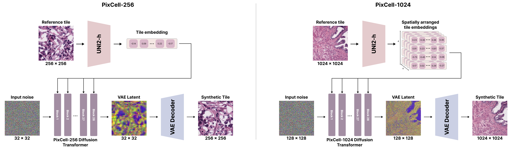

# PixCell: A Pan-Cancer Diffusion Foundation Model

<p align="center">
  <a href="https://arxiv.org/abs/2506.05127"></a> &ensp;
  <a href="https://histodiffusion.github.io/docs/projects/pixcell/"></a> &ensp;
  <a href="https://huggingface.co/StonyBrook-CVLab/PixCell-256"></a> &ensp;
  <a href="https://huggingface.co/StonyBrook-CVLab/PixCell-1024"></a> &ensp;
  <a href="https://huggingface.co/StonyBrook-CVLab/PixCell-original-weights"></a> &ensp;
</p>

---

We present PixCell, the first generative foundation model for digital histopathology. We progressively train our model to generate from 256x256 to 1024x1024 pixel images conditioned on [UNI2-h](https://huggingface.co/MahmoodLab/UNI2-h) embeddings. PixCell achieves state-of-the-art quality in digital pathology image generation and can be seamlessly used to perform targeted data augmentation and generative downstream tasks.




## 🔥 News

- **Nov 2025**: Released the virtual staining models + code.
- **Sep 2025**: Released training + sampling code for PixCell.  
- **June 2025**: Released Hugging Face Diffusers checkpoints for PixCell:
  - [PixCell-256 (Diffusers)](https://huggingface.co/StonyBrook-CVLab/PixCell-256)
  - [PixCell-1024 (Diffusers)](https://huggingface.co/StonyBrook-CVLab/PixCell-1024)

---

## Contents

- [📜 Overview](#-overview)
- [🔧 Dependencies and Installation](#-dependencies-and-installation)
- [📂 Dataset Preparation](#-dataset-preparation)
- [🚀 Training](#-training)
- [🧫 TME-Conditioned ControlNet](#-tme-conditioned-controlnet)
- [🔬 Sampling](#-sampling)
- [🎨 Virtual Staining](#-virtual-staining)
- [📦 Model Zoo](#-model-zoo)
- [📄 Citation](#-citation)

## 🔧 Dependencies and Installation

- Python >= 3.9 (recommend Anaconda or Miniconda)
- PyTorch >= 2.0.1 + CUDA 11.7
```
bash setup.sh
```
---

## 📂 Dataset Preparation

### Patch extraction
We train PixCell on ~70,000 Whole slide images (WSIs) from TCGA, CPTAC, GTeX, etc. WSIs should be preprocessed into patches using DSMIL.

Example structure:

    tcga_diagnostic/
    ├── acc
    │   └── single_1024
    │       ├── TCGA-OR-A5J1-01Z-00-DX1
    │       │   ├── 10_14.jpeg
    │       │   ├── 10_15.jpeg
    │       │   ├── 10_16.jpeg
    │       │   └── 10_17.jpeg
    ...
    cptac/
    gtex/

To support progressive training, we only extract patches at 1024x1024 resolution. Lower resolutions are obtained by extracting crops from the 1024x1024 patches during training. See [diffusion/data/datasets/pan_cancer.py](diffusion/data/datasets/pan_cancer.py) for details.

### Metadata

We index the datasets in an HDF5 file:

    patches/metadata/patch_names_all.hdf5

```
import h5py
f = h5py.File('patches/metadata/patch_names_all.hdf5', 'r')

print(f.keys())
>>> <KeysViewHDF5 ['cptac_1024', 'gtex_1024', 'others_1024', 'sbu_olympus_1024', 'tcga_diagnostic_1024', 'tcga_fresh_frozen_1024']>

print(f['tcga_diagnostic_1024'][:5])
>>> array([b'tcga_diagnostic/lihc/single_1024/TCGA-BC-A8YO-01Z-00-DX1/82_17.jpeg',
       b'tcga_diagnostic/lihc/single_1024/TCGA-BC-A8YO-01Z-00-DX1/26_5.jpeg',
       b'tcga_diagnostic/lihc/single_1024/TCGA-BC-A8YO-01Z-00-DX1/64_11.jpeg',
       b'tcga_diagnostic/lihc/single_1024/TCGA-BC-A8YO-01Z-00-DX1/27_18.jpeg'],
      dtype=object)

```

### Feature Extraction

For each patch, we pre-extract:
- VAE features (sd3vae latents)  
- SSL embeddings (UNI2)

These are stored in the same directory as the images:

    patches/<dataset>/<folder>/<patch>.jpeg
    patches/<dataset>/<folder>/<patch>_sd3_vae.npy
    patches/<dataset>/<folder>/<patch>_uni.npy

Extract features with:

    python extract_features.py --dataset_name tcga_diagnostic --size 256

---

## 🚀 Training

1. Select a config file in `configs/` (examples in `configs/pan_cancer/`).  
   Example: `configs/pan_cancer/pixart_20x_256.py`

2. Launch training:
```
    accelerate launch train_scripts/train_pixcell.py configs/pan_cancer/pixart_20x_256.py \
        --work-dir /path/to/output_dir
```
Options:
- `--work-dir` : output directory for logs + checkpoints  
- `--resume-from` : resume from a checkpoint  
- `--batch-size` : override batch size  

3. Configure accelerate (for multi-GPU/multi-node):
```
    accelerate config
```
---

## 🔄 Progressive Training

PixCell is trained in a **progressive fashion** to improve stability and efficiency (Similar to PixArt-Sigma):  

1. **Stage 1 — Train PixCell-256:**  
   Train the base model on 256×256 patches.  

2. **Stage 2 — Fine-tune PixCell-512:**  
   Initialize from PixCell-256 and fine-tune on 512×512 patches.  

3. **Stage 3 — Fine-tune PixCell-1024:**  
   Initialize from PixCell-512 and fine-tune on 1024×1024 patches.  

Each stage reuses the weights of the previous resolution, allowing faster convergence.  

See the config files in `configs/pan_cancer/` for details.


## 🧫 TME-Conditioned ControlNet

PixCell-ControlNet extends the base model with multi-channel TME (tumor microenvironment) spatial conditioning. Two training stages are supported:

| Stage | Script | Dataset | Purpose |
|-------|--------|---------|---------|
| 1 — Sim pre-training | `train_controlnet_sim.py` | Unpaired sim snapshots + real H&E | Learn spatial layout from simulation |
| 2 — Exp fine-tuning  | `train_controlnet_exp.py` | Paired CODEX + H&E tiles          | Adapt to real experimental domain |

### Data Structure

#### Stage 1 — Simulation data (unpaired)

```
sim_data_root/
├── metadata/
│   ├── sim_index.hdf5          # HDF5: keys like "sim_256" → list of sim_ids
│   └── real_index.hdf5         # HDF5: keys like "real_256" → list of tile_ids
├── sim_channels/               # one sub-folder per TME channel
│   ├── cell_mask/              # binary PNG  (required)
│   ├── oxygen/                 # float PNG or NPY  (required)
│   ├── glucose/                # float PNG or NPY  (optional)
│   └── tgf/                    # float PNG or NPY  (optional)
├── features/
│   └── {tile_id}_uni.npy       # UNI-2h embedding, shape [1536]
└── vae_features/
    ├── {tile_id}_sd3_vae.npy           # H&E VAE latent, shape [32, H/8, W/8]
    └── {tile_id}_mask_sd3_vae.npy      # cell_mask VAE latent (optional)
```

Build the HDF5 index once before training:

```python
from diffusion.data.datasets.sim_controlnet_dataset import build_sim_index, build_real_index
build_sim_index("sim_data_root/sim_channels", "sim_data_root/metadata/sim_index.hdf5")
build_real_index("sim_data_root/features",    "sim_data_root/metadata/real_index.hdf5")
```

#### Stage 2 — Paired experimental data

```
exp_data_root/
├── metadata/
│   └── exp_index.hdf5          # HDF5: keys like "exp_256" → list of tile_ids
├── exp_channels/               # one sub-folder per TME channel (same format as sim_channels)
│   ├── cell_mask/              # binary PNG  (required)
│   ├── cell_type_healthy/      # binary PNG, one-hot  (required)
│   ├── cell_type_cancer/       # binary PNG, one-hot  (required)
│   ├── cell_type_immune/       # binary PNG, one-hot  (required)
│   ├── cell_state_prolif/      # binary PNG, one-hot  (required)
│   ├── cell_state_nonprolif/   # binary PNG, one-hot  (required)
│   ├── cell_state_dead/        # binary PNG, one-hot  (required)
│   ├── vasculature/            # float PNG  (CODEX-derived, optional)
│   ├── oxygen/                 # float PNG  (CODEX-derived, optional)
│   └── glucose/                # float PNG  (CODEX-derived, optional)
├── features/
│   └── {tile_id}_uni.npy       # paired UNI-2h embedding, shape [1536]
└── vae_features/
    ├── {tile_id}_sd3_vae.npy           # paired H&E VAE latent
    └── {tile_id}_mask_sd3_vae.npy      # paired cell_mask VAE latent
```

Build the exp index once:

```python
from diffusion.data.datasets.paired_exp_controlnet_dataset import build_exp_index
build_exp_index("exp_data_root/exp_channels", "exp_data_root/metadata/exp_index.hdf5")
```

### Feature Extraction

Extract UNI-2h embeddings and SD3-VAE latents for all tiles:

```bash
python extract_features.py --data-root /path/to/data --output-dir /path/to/data/features
```

### Training

#### Stage 1 — Sim pre-training

```bash
accelerate launch train_scripts/train_controlnet_sim.py configs/config_controlnet_sim.py \
    --work-dir checkpoints/pixcell_controlnet_sim
```

#### Stage 2 — Exp fine-tuning

```bash
accelerate launch train_scripts/train_controlnet_exp.py configs/config_controlnet_exp.py \
    --work-dir checkpoints/pixcell_controlnet_exp
```

**Common CLI options** (both scripts):

| Flag | Description |
|------|-------------|
| `--work-dir PATH` | Output directory for logs and checkpoints |
| `--resume-from PATH` | Resume ControlNet from a checkpoint directory |
| `--load-from PATH` | Load weights from a specific checkpoint file |
| `--batch-size N` | Override `train_batch_size` from config |
| `--report-to tensorboard` | Logging backend (default: `tensorboard`) |
| `--tracker-project-name NAME` | Project name in the tracker (default: `pixcell_controlnet`) |
| `--debug` | Enable debug mode (reduced steps) |

To resume from a sim checkpoint when starting exp fine-tuning, set in `configs/config_controlnet_exp.py`:

```python
resume_from           = "./checkpoints/pixcell_controlnet_sim/checkpoints/step_0050000"
resume_tme_checkpoint = "./checkpoints/pixcell_controlnet_sim/checkpoints/step_0050000"
```

**Channel reliability weights** (exp only): approximate CODEX-derived channels (vasculature, oxygen, glucose) are automatically attenuated by 0.5× during training, configured via:

```python
channel_reliability_weights = [1.0, 1.0, 1.0, 1.0, 1.0, 1.0, 0.5, 0.5, 0.5]  # in config
```

### TensorBoard Monitoring

Training logs loss, learning rates, and throughput to TensorBoard. Launch the viewer with:

```bash
tensorboard --logdir checkpoints/pixcell_controlnet_sim/logs
# or for exp:
tensorboard --logdir checkpoints/pixcell_controlnet_exp/logs
```

Key metrics to watch:
- `loss` — diffusion MSE loss (should decrease steadily)
- `lr_ctrl` — ControlNet learning rate
- `lr_tme` — TME module learning rate
- `samples_per_sec` — training throughput

### Inference

Two inference modes are supported after training:

**A — Style-conditioned** (reference H&E + TME channels):

```bash
python train_scripts/inference_controlnet.py \
    --config configs/config_controlnet_exp.py \
    --controlnet-ckpt checkpoints/pixcell_controlnet_exp/checkpoints/step_0010000 \
    --tme-ckpt        checkpoints/pixcell_controlnet_exp/checkpoints/step_0010000 \
    --reference-uni   path/to/reference_tile_uni.npy \
    --sim-channels    path/to/sim_channels/
```

**B — TME-only** (no style reference; uses null UNI embedding):

```python
from train_scripts.inference_controlnet import null_uni_embed
uni_embeds = null_uni_embed(device='cuda', dtype=torch.float16)  # shape [1, 1, 1, 1536]
```

### Validation

Evaluate sim→exp domain alignment using cosine similarity in UNI feature space:

```bash
python validate_sim_to_exp.py \
    --config          configs/config_controlnet_exp.py \
    --sim-root        /path/to/sim_data_root \
    --exp-feat        /path/to/exp_features_dir \
    --controlnet-ckpt /path/to/checkpoint_dir \
    --tme-ckpt        /path/to/checkpoint_dir \
    --uni-model       ./pretrained_models/uni-2h \
    --n-tiles         50 \
    --guidance-scale  2.5 \
    --output-dir      ./validation_output
```

Output:
```
  snap_0001: cosine_sim=0.7821
  snap_0002: cosine_sim=0.7543
  ...
=== Validation Results ===
N tiles:          50
Mean cosine sim:  0.771
Std cosine sim:   0.032
```

---

## 🔬 Sampling

We provide sampling scripts for generating 256×256 (PixCell-256) and 1024×1024 (PixCell-1024) patches.

Example for 256×256 generation:

    python sample_256.py \
        --workdir /path/to/workdir \
        --checkpoint checkpoints/last_ema.ckpt \
        --out_dir samples_256 \
        --n_images 5000 \
        --sampling_steps 20 \
        --guidance_strength 2 \
        --sampling_algo dpm-solver

Outputs:

    samples_256/
    ├── real/   # real patches (for FID evaluation)
    ├── syn/    # generated synthetic patches


Using our [CVPR24 Large image generation](https://histodiffusion.github.io/docs/projects/large_image/) algorithm, we can generate 4K×4K images:

    python sample_4k.py \
        --output_dir samples_4k \
        --num_samples 100 \
        --num_timesteps 20 \
        --guidance_scale 2 \
        --sliding_window_size 64 \
        --gpu_id 0

### Hugging Face Diffusers Sampling

We also provide **Diffusers-compatible checkpoints** and sampling code on Hugging Face:

- [PixCell-256 (Diffusers)](https://huggingface.co/StonyBrook-CVLab/PixCell-256)  
- [PixCell-1024 (Diffusers)](https://huggingface.co/StonyBrook-CVLab/PixCell-1024)  

Follow the instructions on those pages to sample using the `diffusers` API.

---

## 🎨 Virtual Staining

### Inference

We provide the implementation of our virtual staining algorithm in a Jupyter notebook [`virtual_staining.ipynb`](virtual_staining/virtual_staining.ipynb).

The virtual staining relies on additional model weights (PixCell-1024 LoRA, flow-matching MLP).
For the four stains of the [MIST dataset](https://github.com/lifangda01/AdaptiveSupervisedPatchNCE) (HER2, ER, PR, Ki67) and the [HER2Match dataset](https://zenodo.org/records/15797050), the notebook downloads the necessary models from our [Huggingface repository](https://huggingface.co/StonyBrook-CVLab/pixcell-virtual-staining).

### Training

We provide scripts for training the PixCell-1024 IHC LoRA and the flow-matching MLP.

For LoRA training, you can run the script using `accelerate`:

    CUDA_VISIBLE_DEVICES=1 accelerate launch --num_processes N \
        virtual_staining/train_lora.py \
        --dataset [MIST/HER2Match] \
        --root_dir /path/to/data/ \
        --split train \
        --stain [HER2/PR/ER/Ki67/ ] \
        --train_batch_size 4 \
        --num_epochs 10 \
        --gradient_accumulation_steps 2

For the MLP training, you can run it as:
    
    python virutal_staining/train_flow_mlp.py \
        --dataset [MIST/HER2Match] \
        --root_dir /path/to/data/ \
        --split train \
        --stain [HER2/PR/ER/Ki67/ ] \
        --device cuda \
        --train_batch_size 4 \
        --num_epochs 100 \
        --save_every 25 \

To speed up training for both the LoRA and MLP, we suggest pre-extracting the UNI embeddings for the images in the dataset. 
The scripts we provide assume that the UNI embeddings are **not** pre-extracted.

---

## 📦 Model Zoo

| Model         | Resolution | Original Checkpoint | Diffusers Checkpoint |
|---------------|------------|---------------------|----------------------|
| PixCell-256   | 256×256    | [HF original](https://huggingface.co/StonyBrook-CVLab/PixCell-original-weights/blob/main/pixcell_256.ckpt) | [HF Diffusers](https://huggingface.co/StonyBrook-CVLab/PixCell-256) |
| PixCell-1024  | 1024×1024  | [HF Original](https://huggingface.co/StonyBrook-CVLab/PixCell-original-weights/blob/main/pixcell_1024.ckpt) | [HF Diffusers](https://huggingface.co/StonyBrook-CVLab/PixCell-1024) |

---


## 📄 Citation

If you use PixCell in your research, please cite:

    @article{yellapragada2025pixcell,
    title={PixCell: A generative foundation model for digital histopathology images},
    author={Yellapragada, Srikar and Graikos, Alexandros and Li, Zilinghan and Triaridis, Kostas and Belagali, Varun and Kapse, Saarthak and Nandi, Tarak Nath and Madduri, Ravi K and Prasanna, Prateek and Kurc, Tahsin and others},
    journal={arXiv preprint arXiv:2506.05127},
    year={2025}
    }

---

## 🤗 Acknowledgements

PixCell builds on PixArt-Sigma and Diffusers.
